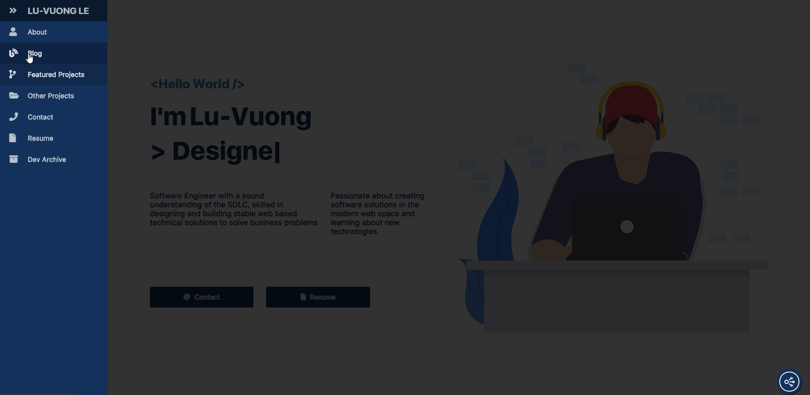

# 100 Days Of Code - Log

## Day 1: Thursday, 9th April, 2020

### Today's Progress

- Worked on CoSketch project to learn websockets with HTML Canvas -> added Login UI
- Looked into how a HashTable is implemented and made some notes
- Coded the basic code structure of a HashTable implementation in JS
- Learned about HTML and CSS progress gauges from [Dcode](https://www.youtube.com/channel/UCjX0FtIZBBVD3YoCcxnDC4g)

**Thoughts:** 
- Working with monorepos and docker is completely different from what I'm used to working with.
- The underlying logic for a HashTable implementation is a bit confusing at times but interesting
- Progress gauges with HTML and CSS is cool! I've always done a normal progress bar

**Work Related Links:**

- [CoSketch Github](https://github.com/luvuong-le/co-sketch)

## Day 2: Friday, 10th April, 2020

### Today's Progress

- Worked on CoSketch project -> Got landing page canvas drawing and web socket client for react setup using WS package for server.

**Thoughts:** 
- Having a harder time setting up WebSockets with React using the native WebSockets Web API and ws Node.JS library instead of using Socket IO like I usually do
- How would you implement rooms with WS? It doesn't come built in like socket IO

**Work Related Links:**

- [CoSketch Github](https://github.com/luvuong-le/co-sketch)

## Day 3: Saturday, 11th April, 2020

### Today's Progress

- No work today. Spent time with family. Good to take a break here and there 😄

## Day 4: Sunday, 12th April, 2020

### Today's Progress

- Published blog post about SemVer and Conventional Commits
- Spent some time to work on React, Canvas, WebSockets project
- Starting to dive into Data Structures and Algorithms again

**Work Related Links:**

- [CoSketch Github](https://github.com/luvuong-le/co-sketch)
- [SemVer and Conventional Commits Post](https://dev.to/luvuongle/semver-and-conventional-commits-4omc)

## Day 5: Monday, 13th April, 2020

### Today's Progress

- Focused on watching the JS course on data structures and algorithms by Colt Steele and taking notes.

- Namely Big O Notation! something I've never really understood fully

**Thoughts:** 

- I think this will give my skills as a developer a much needed boost
- I've always had trouble understanding concepts like Big O Notation so this is very helpful

## Day 6 / 7: Tuesday 14th April 2020 & Wednesday 15th April 2020

### Today's Progress

- Continued with course on Udemy

- Tried out new knowledge with some Big O Notation questions (need more practice though)

- Also thinking of creating a blog separate from my personal website but have other projects to finish first!

## Day 8 & 9: Thursday 16th April 2020 & Friday 17th April 2020

### Today's Progress

- These Udemy courses sure take a while but worth it! 
- Messing around more with docker & docker-compose basics

PC decided to BSOD on me so spent time fixing that and decided to remove my dual boot ubuntu finally...

## Day 10: Saturday 18th April 2020

### Today's Progress

- Doing some improvements to my portfolio

- So many more improvements I can do to it and one of the main ones is setting up a blog!

- I've spent time researching and setting up Netlify CMS with Gatsby JS

**Work Related Links:**

- [Portfolio Github](https://github.com/luvuong-le/lu-vuong-le.me)

## Day 11: Sunday 19th April 2020

### Today's Progress

Learned how to set up a workflow for blogging on my portfolio with Gatsby

Have the basics sorted on my site making use of Netlify CMS but still far from done overall 😁

**Work Demos**

**Work Related Links:**

- [Portfolio Github](https://github.com/luvuong-le/lu-vuong-le.me)

## Day 12: Monday 20th April 2020

### Today's Progress

Blog is coming along slowly but surely and I'm learning a lot with how all this integrates together with Gatsby and Markdown. I think I might need a CSS overhaul after this though...

**Work Demos**

**Work Related Links:**

- [Portfolio Github](https://github.com/luvuong-le/lu-vuong-le.me)

## Day 13 & 14: Tuesday 21st & Wednesday 22nd April 2020

### Today's Progress

- Continuing Udemy course after taking a break

- Wanted to work on other things aside from my portfolio blog so decided to try out a data visualization library (Recharts) with React and Typescript

## Day 15: Thursday 23rd April 2020

### Today's Progress = Rest Day

## Day 16 & 17: Friday 24th & Saturday 25th April 2020

### Today's Progress

Implemented searching functionality with Algolia and Gatsby on personal blog

**Thoughts** 

I'm also dreading the major CSS refactor that eventually awaits me

- [Portfolio Github](https://github.com/luvuong-le/lu-vuong-le.me)

## Day 18 & 19: Sunday 26th & Monday 27th April 2020

### Today's Progress

- Added Disqus comments to blog and copy to clipboard for code blocks in markdown
- Created a random generator for fun

## Day 20: Tuesday 28th April 2020

### Today's Progress

- Udemy Course (Data Structures Colt Steele)
- Writing down notes and learning

## Day 21: Wednesday 29th April 2020

### Today's Progress

- Learning how to create a CSS Masonry layout

## Day 22: Thursday 30th April, May 2020

### Today's Progress

- Rest Day 💤
- Reading Books 📖

## Day 23 & 24: Friday 1st & Saturday 2nd of May 2020

Colt Steele Udemy Course progressed. Really good to get a refresher over problem-solving strategies 

Working on a blog post about CSS Specificity ✏️

## Day 25: Sunday 3rd of May 2020

Worked on a Pixel Art Maker with HTML CSS JS 🎨

## Day 26: Monday 4th of May 2020

CSS art tutorial and extending my own!

## Day 27 & 28: Tuesday 5th & Wednesday 6th of May 2020

Rest Day

Found out about (no bundler build tool) and researching/playing around with it

[Snowpack](https://www.snowpack.dev/)

## Day 29: Thursday 7th of May 2020

- Published a blog post on CSS Specificity
- Finishing CSS art tutorial

Plan tomorrow is to attempt a CSS Nintendo Switch Art